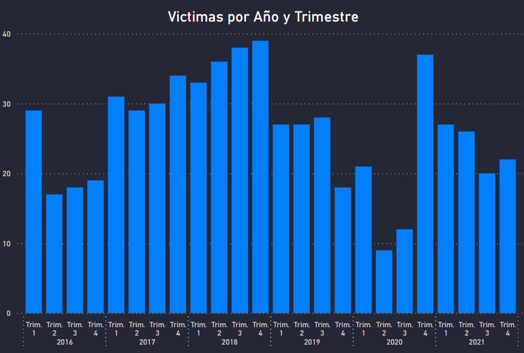
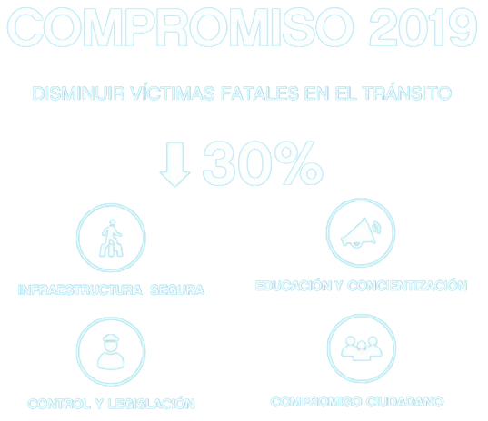
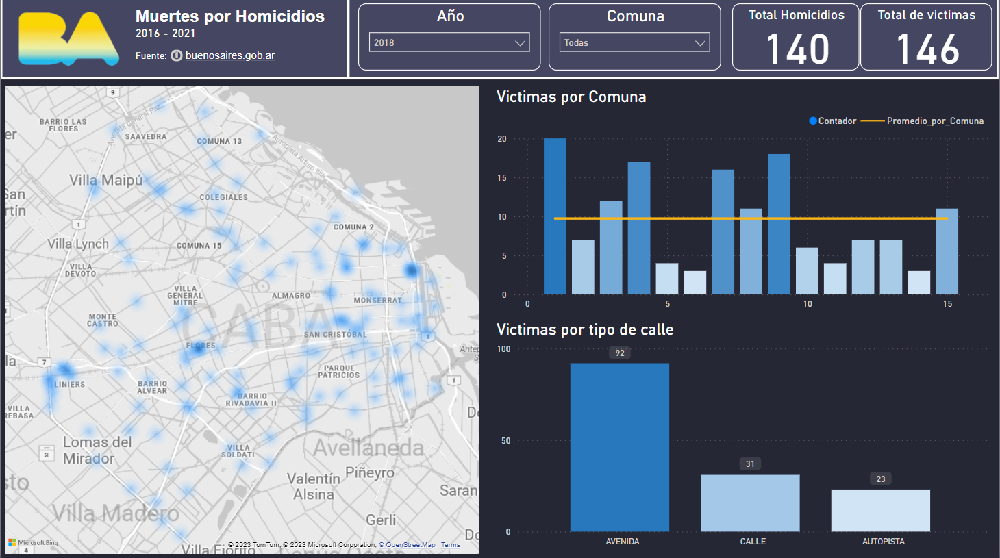
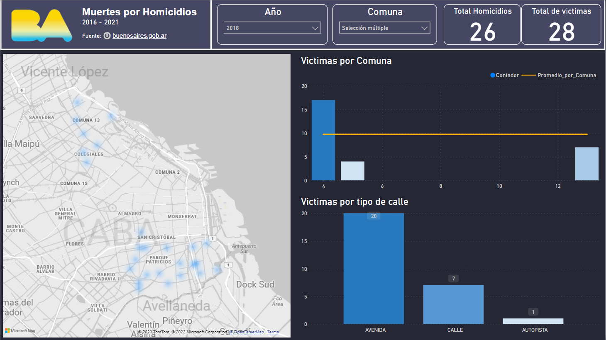
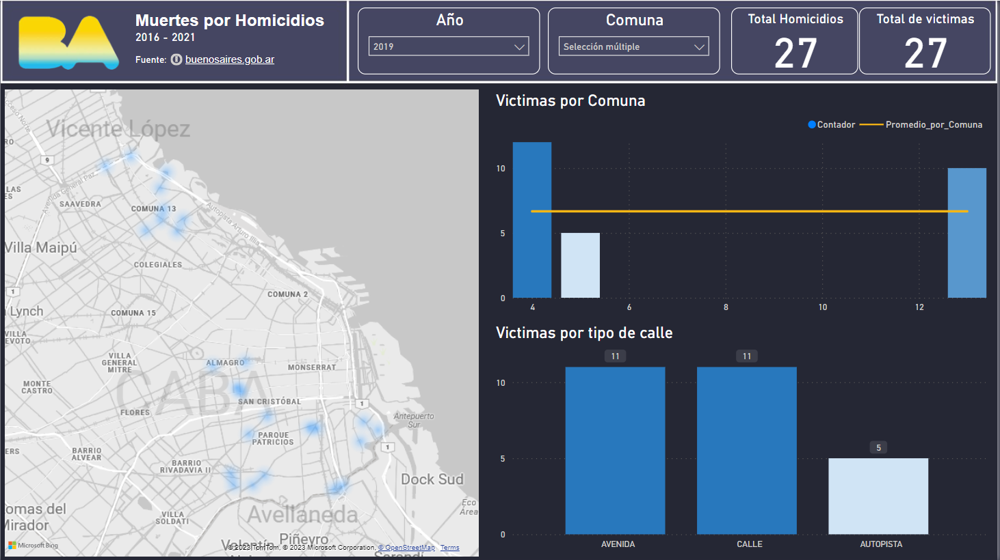
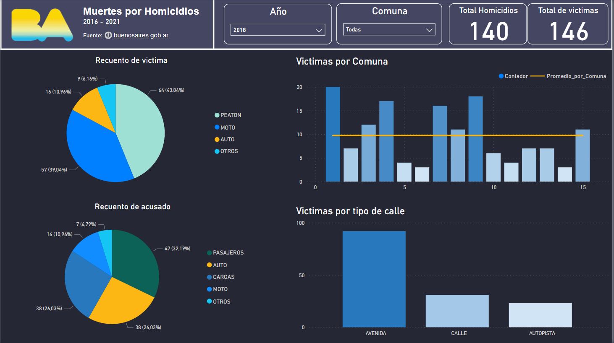
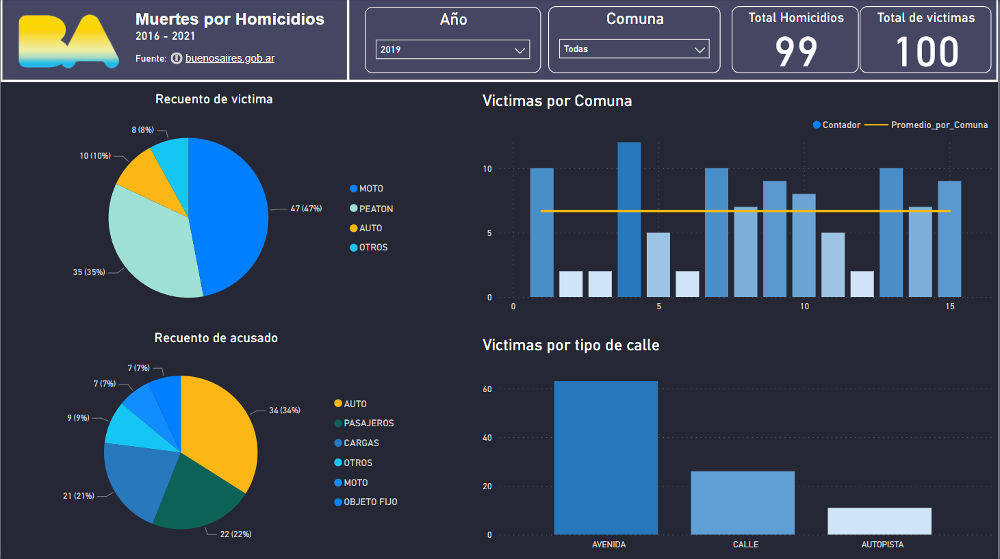
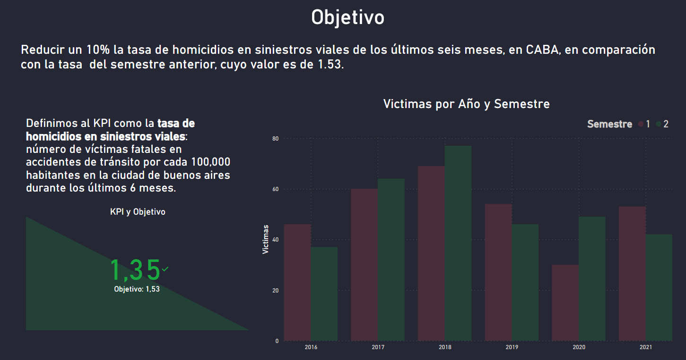

# Proyecto Individual Nº 2

# *Siniestros Viales*

## **Introduccion**

Este estudio aborda los datos de los homicidios en siniestros viales en la Ciudad de Buenos Aires en el período 2016 - 2021. A través de un análisis de incidentes mortales en las vías urbanas, exploramos patrones, factores contribuyentes y características que rodean a estos trágicos eventos. Desde su desarrollo a lo largo del tiempo, hasta la identificación de áreas de alto riesgo. 

## **Rol a desarrollar**

El Observatorio de Movilidad y Seguridad Vial (OMSV), nos solicita la elaboración de un proyecto de análisis de datos, con el fin de generar información que les permita a las autoridades de la Ciudad de Buenos Aires tomar medidas para disminuir la cantidad de víctimas en homicidios de los siniestros viales. 

Para ello, nos disponibilidad un dataset sobre homicidios en siniestros viales acaecidos en la Ciudad de Buenos Aires durante el periodo 2016-2021. Este dataset se encuentra en formato *xlsx* y contiene dos hojas llamadas: **hechos** y **víctimas**. Asimismo, observarán que incluye otras dos hojas adicionales de diccionarios de datos, que les podrá servir de guía para un mayor entendimiento de la data compartida.

## Objevito
Reducir un 10% la tasa de homicidios en siniestros viales de los últimos seis meses, en CABA, en comparación con la tasa del semestre anterior.

## **Descripcion:**

En la primera etapa nos encargamos de la Carga, Exploración y Transformación de los datos brindados [Homicidios](DataSets/Inicial/homicidios.xlsx), estos pasos se encuentran detallados y desarrollados en el archivo [Eda_Homicidios](EDA_Homocidios.ipynb). En esta etapa nos enfocaremos en la recolección y limpieza de nuestro conjunto de datos; rellenando nulos; cambiando formatos; creando columnas nuevas; quitando duplicados y columnas innecesarias. 

Con los datos limpios, pasamos a un análisis exploratorio para comprender mejor los datos que tenemos, a través de mapas, graficas e histogramas buscamos variables de interés.

Variables de interés:

* **fecha:** fecha en formato dd/mm/aaaa
* **victima:** Vehículo que ocupaba quien haya fallecido , o bien peatón/a.
* **sexo:** Sexo informado por fuente policial de la víctima
* **edad:** Edad de la víctima al momento del siniestro
* **fecha_fallecimiento:** Fecha de fallecimiento de la víctima
* **ID:** identificador unico del siniestro
* **n_victimas:** cantidad de víctimas
* **hora:** hora del siniestro
* **tipo_calle:** Tipo de arteria. En el caso de intersecciones a nivel se clasifica según la de mayor jerarquía
* **calle:** nombre de la arteria donde se produjo el hecho
* **comuna:** Comuna de la ciudad (1 a 15)
* **longitud:** longitud con separador punto.
* **latitud:** latitud con separador punto.
* **acusado:** Vehículo que ocupaba quien resultó acusado/a del hecho, sin implicar culpabilidad legal

Los Nulos de estas variables fueron eliminados, ya que correspondían a un 1% del total, excepto por:

- **fecha_fallecimiento:** nulos en estos campos, indica que las victimas entran en la categoría de lesiones culposas, y no en homicidios. Como nuestro objetivo es reducir la tasa de homicidios, procedemos a borrar estos nulos.
- **edad:** se utilizó la mediana para rellenar estos nulos, ya que se podía notar una tendencia en la edad de las víctimas.

Como no se encontraron duplicados, se cambió el formato de las variables para su posterior análisis:

* **fecha:** formato fech: dd/mm/aaaa
* **victima:** variable categorica
* **sexo:** variable categorica
* **edad:** formato entero
* **fecha_fallecimiento:** formato fech: dd/mm/aaaa
* **ID:** formato string
* **n_victimas:** formato entero
* **hora:** formato hora: h:m:s
* **tipo_calle:** variable categorica
* **calle:** formato string
* **comuna:** variable categorica
* **longitud:** formato float
* **latitud:** formato float
* **acusado:** variable categorica

Con estos datos, se realizó un análisis grafico de los homicidios: viendo como los datos cambian a lo largo del tiempo, haciendo un análisis por ubicación y otro por tipo de víctima. Para esto se utilizó la herramienta 'Power BI', el análisis se encuentra publicado en el siguiente enlace: 🔗[Presentacion-Homicidios](https://www.novypro.com/project/homicidios-power-bi).

### Analisis de tiempo:

Graficando por año y trimestre, podemos ver como la cantidad de homicidios varia a lo largo de nuestro periodo.

Podemos observar una tendencia al alza en los años 2016-2017-2018. Y luego una caída en homicidios para los años 2019-2020. ¿A qué se debe esto?

La Secretaría de Transporte también ha notado el incremento de muertes en siniestros viales del periodo 2016-2018. Como respuesta propuso un plan de Seguridad Vial, con el objetivo de reducir un 30% estas muertes.

Para 2020 notamos nuevamente una caída en homicidios. Esto se debe al periodo de Pandemia que ha atravesado todo el país, generando un aislamiento social a través de una cuarentena.

Usando los datos brindados por Clarín, podemos ver como estas medidas impactan en nuestros datos:

 **Segundo trimestre:**
* 19 de marzo: Se estableció la cuarentena en todo el país. (Finales del primer trimestre)
* 25 de abril: Flexibilización de la cuarentena estricta.

 **Tercer trimestre:**
* 17 de septiembre: permitidos los partidos de fútbol.
* La flexibilización es cada vez mayor

 **Cuarto trimestre:**
* 14 de octubre: reabierto vuelos, bares y gimnasios porteños. 
* Noviembre: vuelta a las clases presenciales. (Finaliza completamente la cuarentena)

Al finalizar la cuarentena, vemos que las medidas tomadas en 2019 siguen vigentes, ya que obtenemos valores similares para 2021:

## Veamos como estas medidas afectan a nuestros datos por ubicación:

Vemos un decremento en el promedio de homicidios por comuna. Y también un gran decremento de homicidios para las comunas de valores más altos:
* Comuna 1: de 20 víctimas a 10
* Comuna 7: de 16 víctimas a 10
* Comuna 9: de 18 víctimas a 9

Vemos que para la Comuna 4, 5 y 13 el número de víctimas se mantuvo:
* Comuna 4: de 15 víctimas a 12 
* Comuna 5: de 4 víctimas a 5
* Comuna 13: de 7 víctimas a 10 

Veamos que nos arroja los datos:

Vemos que los homicidios en Avenidas se han reducido, pero han aumentado los homicidios en otro tipo de calle.

### Analisis por tipo de victima y acusado

Vemos que el tipo de victima más afectada por estas medidas fueron los peatones, reduciendo su porcentaje de 43,8% (64 Victimas) a 35% (35 Victimas).

En cuanto a los acusados, se tuvo un control sobre pasajeros y cargas, reduciendo sus números de 47 y 38 a 22 y 21 respectivamente.

Como podemos ver el objetivo propuesto se ha cumplido, ya que la tasa de homicidios en el segundo semestre de 2021 inferior a la del primer semestre en más de un 10%.

## Conclusiones:

Hemos observado como los hechos cambian a lo largo del tiempo, pasando por diferentes eventos que modifican nuestras variables.

Vimos como las medidas de las autoridades locales tienen un impacto en la zona de los homicidios y en los participantes de estos (victima-acusado). 

Del análisis de homicidios por ubicación, podemos tomar dos posturas al momento de aplicar medidas correctivas:

* Basándonos en números generales, aplicar medidas en todas las zonas centrándonos en el tipo de calle o acusado que más siniestros generan. Esta opción reduce los homicidios de forma general, pero funciona deficientemente para casos particulares como los ya analizados.
* Hacer un análisis particular para cada zona, viendo que tipo de calle y victima son más frecuentes para cada comuna y tipo de calle.

La postura y las acciones a tomar quedan a discreción de las autoridades locales. A través del informe interactivo presentado, estas autoridades tienen la capacidad de visualizar la distribución de homicidios por zona y tipo de participante, así como analizar el impacto de las medidas aplicadas en el pasado.

### **Fuentes:**

Data Set:
[Buenos Aires Data](https://data.buenosaires.gob.ar/dataset/victimas-siniestros-viales)

Plan de Seguridad Vial:
[Secretaria de Transporte](https://buenosaires.gob.ar/movilidad/plan-de-seguridad-vial/plan-de-seguridad-vial-de-la-ciudad)

Datos de la Cuarentena:
[Clarín-Noticias](https://www.clarin.com/sociedad/cuando-empezaron-la-pandemia-y-la-cuarentena-en-argentina_0_moJdSsniMc.html)